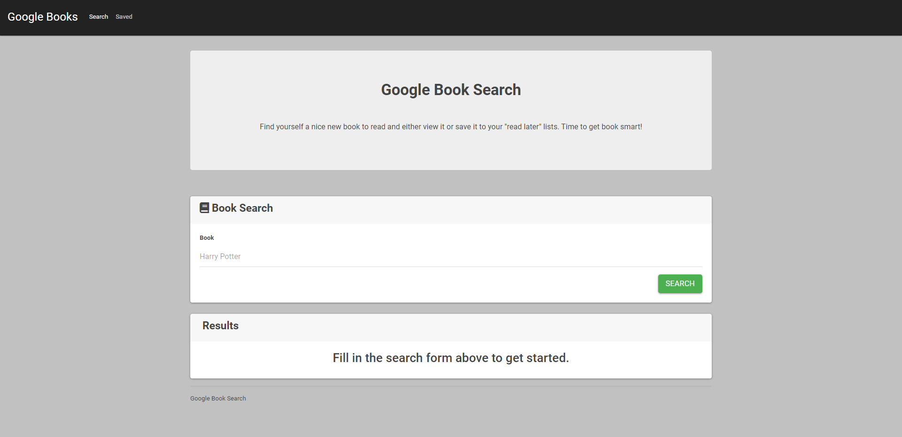

# google-books
A book search app where users can search for a book that they may be interested in and view it on Google Store.

Users can also save books for later by clicking save which will add the book to a list.

## Contents
Section | Description
------------ | -------------
[Screenshot](#screenshot) | Screenshots of the Google Book Search app and a link to the repo.
[Functionality](#functionality) | Information on the functionality of the Google Book Search app.
[Licence](#licence) | Licence for the source code

## Screenshot

You can access the Google Book Search app [here](https://kvtemadden-books-library.herokuapp.com/)

You can access the GitHub Repo via [this link](https://github.com/kvtemadden/google-books)

## Functionality
The Google Book Search app allows users to type in the title of a book and see whether it's available on Google Store.

Once the user has clicked search for the book they want to find, similar or relevant books will appear in a list using the Google API.

Beside each book and the blurb, two buttons display: View and Save.

View will take the user to a Google Store page where they can view or buy the book.

Save will allow the user to save the book to their list of saved items.

## Licence
> This site was created under the standard MIT licence.

